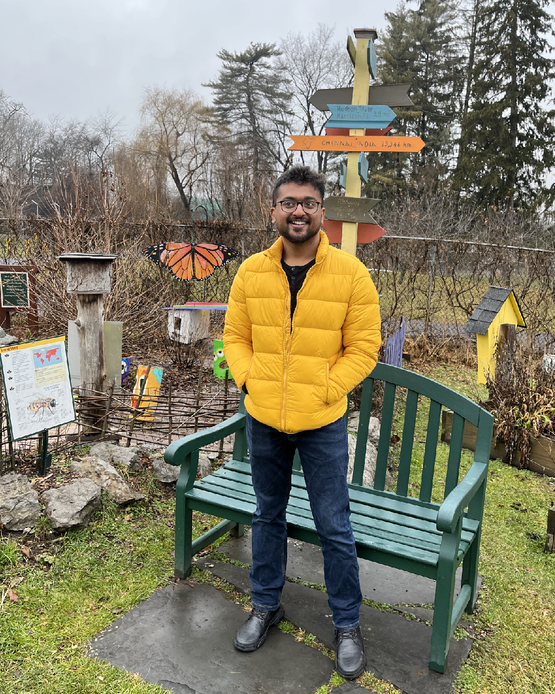

# Introduction  
Name: Lohith Bollineni  
Course: Advanced Web Programming  
Semester: Spring 2022  

I'm a graduate student studying computer Science now but my undergrad major was Electronics and Communications. During my undergrad, I realized that I like the software part of the subject more than the hardware and hence I decided to study Computer Science as a focus. I neither knew programming nor the beauty of it until my third year of undergrad. Once I did, I could think of so many ideas of mine that could actually happen due to programming. I started by learning Web development basics (like HTML, CSS and JavaScript) and then went on to learn Android Mobile App Development after studying some basic Java. There were hundreds of resources on the internet to make clones of projects. I tried them initially to learn how it's done. Once I figured out the basics, I was no longer interested in replicating someone's projects. I wanted to make my own projects and hence I started working on a game app called Bytes. It is available on play store under Ox Apps brand. It's a different version of the popular arcade game "Whack-a-mole". After that I worked on a few projects but didn't deploy them anywhere. Some of them include applications where I'd ask a girl out through a Java program for example. I started working on a social app called Caramel which is still in development, because I didn't get enough time to work on it completely. But I hope to finish it soon. It'll be available on different platforms like web, android and iOS.
  
That brings me to the point where I'll be implementing my learnings from this course. I've been working on a website called Ox:an app portal (www.oxappportal.com). It's a website where I'll be uploading different projects that I've been working on/I'll be working on. Basically it's like a portfolio of apps, where instead of redirecting to somewhere like GitHub, you can interact with the app real time directly on the website. It'll be built on React though, instead of Vue. Otherwise I hope all the learnings from this course come handy for the project. Along with this, I'll be working on few more projects which are web based. Hence I'm really looking forward to learn and implement everything I've learnt.
  

